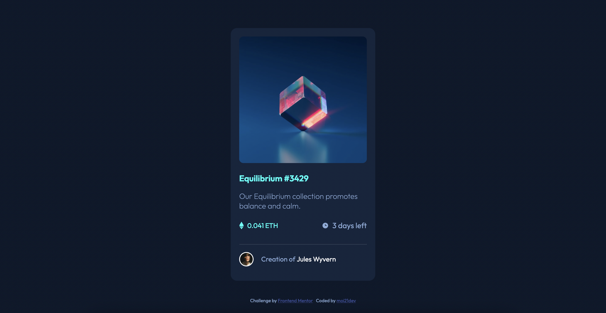
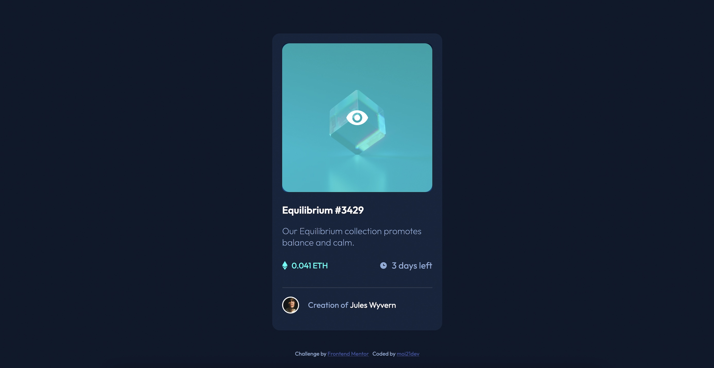
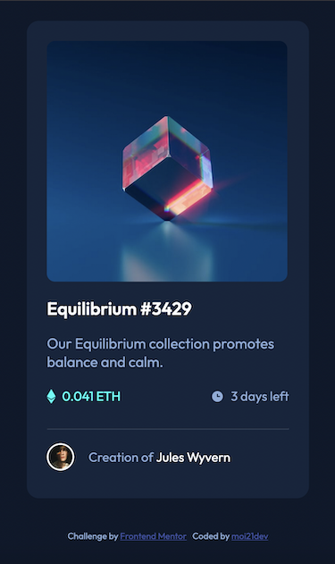

# Frontend Mentor - NFT preview card component solution

This is a solution to the [NFT preview card component challenge on Frontend Mentor](https://www.frontendmentor.io/challenges/nft-preview-card-component-SbdUL_w0U). Frontend Mentor challenges help you improve your coding skills by building realistic projects. 

## Table of contents

- [Overview](#overview)
  - [The challenge](#the-challenge)
  - [Screenshot](#screenshot)
  - [Links](#links)
- [My process](#my-process)
  - [Built with](#built-with)
  - [What I learned](#what-i-learned)
  - [Continued development](#continued-development)
  - [Useful resources](#useful-resources)
- [Author](#author)
- [Acknowledgments](#acknowledgments)

## Overview

### The challenge

Users should be able to:

- View the optimal layout depending on their device's screen size
- See hover states for interactive elements

### Screenshot





### Links

- Solution URL: [Frontend Mentor](https://www.frontendmentor.io/solutions/nft-card-flexbox-mastery-and-hover-trickeries-8rehD6UUlh)
- Live Site URL: [Github Pages](https://moi21dev.github.io/ntf-card/)

## My process

### Built with

- Semantic HTML5 markup
- CSS custom properties
- Flexbox

### What I learned

I have really enjoyed this challenge, it's my favorite one so far! I was able to test and train my Flexbox skills and make an image overlay, for the first time.
To make an image overlay over another image, the structure in HTML should be like:
```html
<div class="images-container">

  

    <div class="overlay">

      

    </div>

</div>
```
in CSS:
```css
/* first-image and overlay image container */
.images-container {
    position: relative;
}

/* image */
.first-image {
display: block;
position: relative;
width: 100%;
}

/* overlay container */
.overlay {
position: absolute;
top: 0;
width: 100%;
height: 100%;
display: flex;
flex-direction: column;
justify-content: center;
align-items: center;
border-radius: 15px;
width: 100%;
overflow: hidden;
}

.overlay img {
opacity: 0;
}

/* hover over nft card image */
.images-container:hover img{
opacity: 1;
transition: 0.3s ease-in-out;
}

.overlay:hover {
cursor: pointer;
background-color: hsla(178, 100%, 50%, 0.6);
}

```

### Continued development

I'll aim to have a better understanding of:
* Overlay
* Flexbox
* CSS Grid

### Useful resources

- For Flexbox: Joshua Comeau's [interactive guide to Flexbox](https://www.joshwcomeau.com/css/interactive-guide-to-flexbox/).

- The image overlay was the trickiest part, but thanks to [MDN web docs on CSS opacity](https://developer.mozilla.org/en-US/docs/Web/CSS/opacity) and [Code Instinct](https://www.youtube.com/watch?v=yfg9ChTmuKM)'s video I've managed to make it.

- Not that I needed it for this challenge, but I came across a very useful tool: the [Color Code Converter](https://web-toolbox.dev/en/tools/color-converter).

## Author
- Frontend Mentor - [moi21dev](https://www.frontendmentor.io/profile/moi21dev)

## Acknowledgments
* I feel that I finally got to understand how Flexbox works thanks to the suggestions kindly provided by [@zsoolti8917](https://www.frontendmentor.io/profile/zsoltvarju) in [result summary component](https://github.com/moi21dev/results-summary-component.git) challenge.
